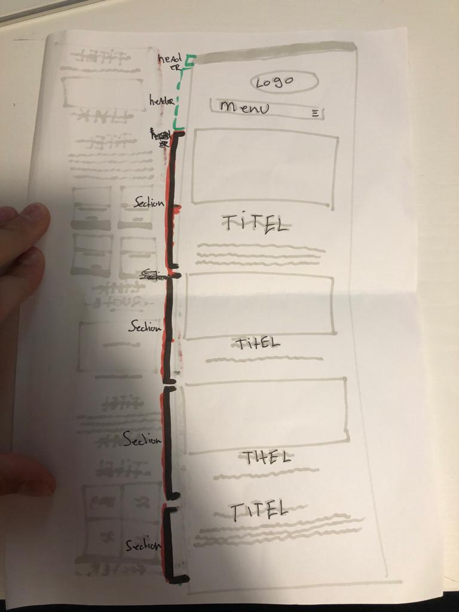
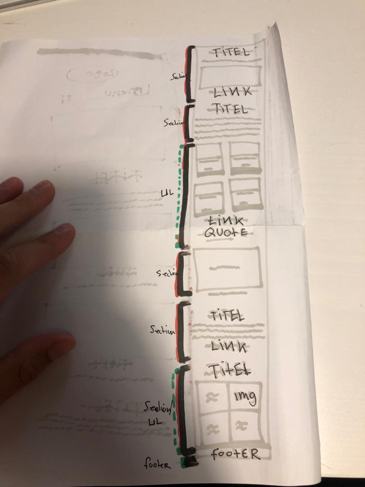
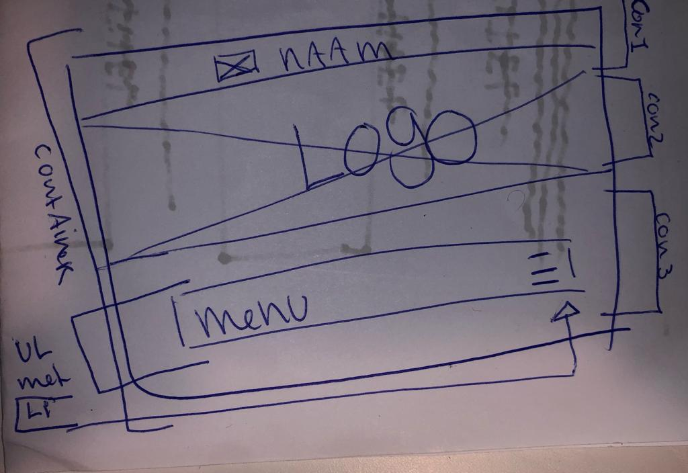
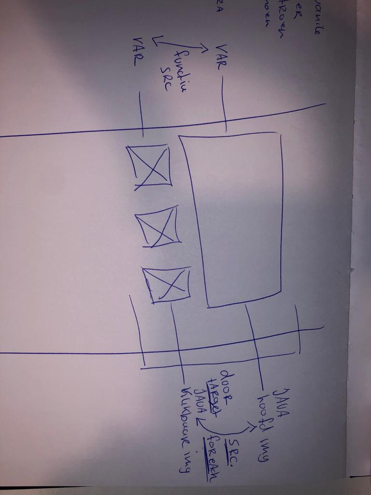

# Procesverslag
Markdown is een simpele manier om HTML te schrijven.  
Markdown cheat cheet: [Hulp bij het schrijven van Markdown](https://github.com/adam-p/markdown-here/wiki/Markdown-Cheatsheet).

Nb. De standaardstructuur en de spartaanse opmaak van de README.md zijn helemaal prima. Het gaat om de inhoud van je procesverslag. Besteedt de tijd voor pracht en praal aan je website.

Nb. Door *open* toe te voegen aan een *details* element kun je deze standaard open zetten. Fijn om dat steeds voor de relevante stuk(ken) te doen.

## Jij

  
uitwerken voor kick-off werkgroep

  ### Auteur:
  Diaz Cabrera

  #### Je startniveau:
  Start niveau (BLAUW)

  #### Je focus:
  Bling Bling 
 

## Je website

  
uitwerken voor kick-off werkgroep

  ### Je opdracht:
  https://brandtkaarsen.nl/

  #### Screenshot(s) van de eerste pagina (small screen): 
  Home page (https://brandtkaarsen.nl/)
  

  #### Screenshot(s) van de tweede pagina (small screen):
  Product pagina (https://brandtkaarsen.nl/product/kaarsen-6-theelichtjes/)
  

## Toegankelijkheidstest 1/2 (week 1)

  
uitwerken na test in 1e werkgroep

  ### Bevindingen
- Geen skip to main content button. 
- Moeilijk om je muis te volgen 
- Moeilijk om de kleuren onderscheid van bepaalde teksten te kunnen zien 
- Niet makkelijk je mobiel vast kunnen houden 
- Moeite met scrollen 
- slecht door kunnen tabben
- screen reader is onduidelijkheid in volgorde van oplezen.

  #### Screenreader
 Een manier om je h1 en p elementen (nog meer), op te kunnen lezen voor mensen die blind zijn om op een of andere manier de computer op normale wijze te kunnen gebruiken. echter heb ik dit getest met de orginele brandt kaarsen website. Hier zijn verschillende bevindingen uit gekomen. 

Verder 

  #### Muis en Toetsenbord 
  - Het toetsenbord was lastig moeilijk om naar te kijken. Je moest je goed focussen om wat je wou typpen. 
  - Daarnaast was het lastig om je eigen muis te volgen op het beeldscherm. Zeker omdat mijn muis snel beweegt was het last bij te houden. Dit leide ertoe dat ik een heel stuk slomer was op mijn laptop. 

  #### Motoriek (shocks, elastiekjes)
 - Het vast houden van de telefoon was ontzetten moeilijk (onmogelijk). Al gouw merkte ik dat als je de telefoon op tafel legt om er vanuit daar op te werken het lastig werdt om interactie te hebben met de buttens, typpen of gevevens te voeren. 
 - Ook was het scrollen op de laptop moeilijk om te doen, op een of andere manier had je niet volledig controle over je eigen en hand (en laat staan je vingers). Hierdoor had je geen geleide controlle over hebben scrollen op de trackpad.

  #### Visueel (brillen, contrast, kleurenblind, dark/light). 
- De teksten lezen op deze manier was vrij moeilijk te doen. Ik heb het een tijdje geprobeerd op de laptop en telefoon, maar ben hiermee gestopt omdat ik hoofdpijn kreeg. Ik had veel concetratie en focus nodig om dit in goede banen te leiden.
- Verschillen tussen de buttons en teksten was moeilijk te zien, zeker als het een groot opervlakt was. 

## Breakdownschets (week 1)

 
  
uitwerken na afloop 2e werkgroep

  ### de hele pagina: 
   

  ### dynamisch deel (bijv menu): 
  

  ### wellicht nog een dynamisch deel (bijv filter): 
  

Ik heb een schets gemaakt op het bord en op papier van welke elementen en sectie's ik wil gaan gebruiken om mijn website met een correcte semantiek op te bouwen. Hier heb ik heb ik lang achter gezetten omdat ik merkte dat ik gauw te ingewikkeld denk. 

toch is de uiteindelijk goed uitgewerkt, en ben ik boven mijn verbazing goed onderweg met de code. Deze opzet van de elementen etc. heeft mij hier goed mee geholpen. 

Het voornaamste deel waar ik moeite mee had was het bouwen van de header/navigatie. Ik heb moeten leren over hoe een flexbox werkt wat betreft flex-direction.

## Voortgang 1 (week 2)

  
uitwerken voor 1e voortgang

  ### Stand van zaken
 - Vrij veel dingen gingen goed naast dat ik het lastig vondt op de juiste semantiek te gebruiken voor bepaalde sectie's (vooral met flexboxen moest ik extra goed opletten) 
 
 - Ik verwacht ook nog moeite te hebben met hover/focus/active/before/after elementen te krijgen. Maar afgelopen les is dit goed toegelicht en heb ik oefeningen gezien die mij hiermee kunnen helpen. 
 
 - Het enige lastig tot nu toe in mijn website is de (header) met name de navigatie wat betreft position relative en position absolute etc. toch is het gelukt om hier mee te werken na afgelopen les (14 september). Dus ik verwacht/hoop dit zelf oplossen. 

  ### Agenda voor meeting
  samen met je groepje opstellen (mijn groepje was niet actief om hier wat mee te doen. Dus dit heb ik maar voor mijzelf gedaan :).

student 4                                                                                                               |
Diaz Cabrera                                                                                                            |
- Voorbeelden van position relative en position absoluut in een flexbox (column)                                        |
- Hoe ik met buttons hover (before, after en active kan werken in mijn Css) Hoe spreek ik dit correct aan in mijn Css ? |
- Hoe ik het beste mijn Css kan ordenenen? Wat zijn de mogelijkheden? 
- Is het raar om meer dan 10 section's te hebben in je HTML?                                                            |

  ### Verslag van meeting
  hier na afloop snel de uitkomsten van de meeting vastleggen

  - Ik heb te horen gekregen dat er oefeningen gaan komen waar we hier op gaan verdiepen. Deze zal ik dan zeer zeker ook doen. Ik heb ook verschillende artikelen toegestuurt gekregen om mijzelf alvast hierop in te lezen. https://www.tutorialrepublic.com/css-tutorial/css-links.php.
  -  Buttons hover en andere states blijken we later in de weken dieper op in te gaan. Ik heb zelf het hef in handen genomen om mijzelf hier op in te lezen. Achteraf bijkt dit niet heel lastig te zijn, maar je moet het wel even begrijpen. 
  - Verschillende manieren van het ordenenen zijn er zeker, het is an mij hoe ik dit wil gaan doen. Voor nu wil ik dit met comments gaan doen. Zo kan ik snel en overzchtelijk zien wel sections waar staan in mijn css. Ook is dit makkelijk terug te vinden aan de hand van (comand f een zoekfunctie binnen je document).
  - Mij is vertelt dat dit niet raar is, echter is er een mogelijkheid om deze sections te optimaliseren maar dan zal ik de slectors binnen bij css opnieuw moeten aansprekn. Ook zullen de selector lijnen groter worden en zo minder overzichtelijk. 

## Voortgang 2 (week 3)

  
uitwerken voor 2e voortgang

  ### Stand van zaken
De stand van zaken.... Het gaat redelijk, ik moet zeggen ik zit op moment dagen/nachten lang achter mijn computer om te coderen. Ik merk dat ik vroeg in de ochtend of midden in de nacht het beste kan coderen. 
- Wat betreft de website ben ik goed onderweg. Ik lig op schema, structuur van de HTML staat. Ik ben al begonnen met de css om de website te stylen, hier ben ik ook al redelijk ver mee. ik merk dat ik de slectors beter begin te begrijpen. Dit helpt mij enorm. 

  ### Agenda voor meeting
  samen met je groepje opstellen (mijn groepje was niet actief om hier wat mee te doen. Dus dit heb ik maar voor mijzelf gedaan :).

student 4                                                                                                               
Diaz Cabrera                                                                                                            
- display flex beter begrijpen. Zijn hier oefeningen voor?
- De javascript voor het tonen van mijn volledige hamburger menu. hoe kan ik dit het beste aanpakken? 
- De section indeling van mijn main. ik zit nu op 10 sections, gebruik ik deze niet teveel ? (vraag?)
- Kan je een section in een section doen voor een artikelen overzicht of moet ik dit in een andere slector doen?

  ### Verslag van meeting
  hier na afloop snel de uitkomsten van de meeting vastleggen

Om te beginnnen heb ik een flinke tegenvaller te horen gekrgen. Ik ben namelijk niet zo slim geweest om te beginnen met het bouwen voor desktop. Ik ga namelijk voor bling bling, en dit houdt in dat het voor mobiel gebouwd moet worden. Ik zal nu dus de hele home page moeten omzetten naar mobiel. Mij is vertelt dat ik het beste van scratch weer kan beginnen, want om dit van desktop naar mobiel om te zetten schijnt ontzettend moeilijk te zijn. Dit ga ik dan maar doen........ :(

  - Ik heb de frogy frog oefeningen nog een keer gedaan, hierdoor begrijp ik de property's en value's beter. 
  - De javascript ben ik mee geholpen, gelukkig heeft Ymaro hier de tijd voor genomen zodat ik dit goed kon volgen en   gedeeltelijk zelf kon doen. (met name de functie aanroepen was lastig)
  - Ik heb de <artikel> ontdekt wat ontzetten handig is met het stijlen en het ordenen van mijn Css. Dit zal ik vaker nodig hebben in mijn website pages. 

## Toegankelijkheidstest 2/2 (week 4)

  
uitwerken na test in 8e werkgroep

  Afgelopen week (vandaag de dag 30 september 2022). Zijn allerlei verschillende updates doorgevoerd in de orginele website. zo heeft de website een sticky nav bar/winkel mand gekregen. Ook hebben ze duidelijk aan de toegankelijkheid gewerkt. Toch zijn er nog steeds een aantal punten die ik kan verbeteren in mijn website.

  ### Bevindingen
  Lijst met je bevindingen die in de test naar voren kwamen (geef ook aan wat er verbeterd is):
  - skip to main content button, echter geeft deze niet een goede tab volorde op de website. Je komt correct langs alle plaatjes maar niet de teksten (p), op een of andere manier wordt deze uitgesloten. Hier moet ik nog aan werken. 
  - Ook ga ik een tab functie binnen de de navigatie toevoegen, dus op moment dat je op hamburger menu komt je ook door de pagina mogelijkheden kan tabben.

  #### Screenreader
  De website is gebouwd aan de hand van div's met wordpress. Dus de screen reader heeft geen goede indicatie van hoe hij door de website heen leest. Gaat allemaal erg rommelig. In mijn hudige website heb ik de juiste semantiek gebruikt waardoor het duidelijk is wat er aan content op de pagina staat. ik heb het geprobeerd na te bootsen door mijn ogen dicht te doen en te luisteren wat hij vertelt. ik kon zo gemakkelijk alle content volgen. 

  #### Muis en Toetsenbord 
  - ik vondt dit moeilijk om te testen omdat ik inmiddels de website uit mijn hoofd ken. Toch had ik moeite met de blinden bril om de juiste toetsen te kunnen vinden. Een van de opdrachten die ik heb aangehouden was om een contact formulier op te sturen. Daar merkte ik dat ik moeite had met typen. Het tabben door de website was voor de rest prima te doen. 

  #### Motoriek (shocks, elastiekjes)
  - Het scrollen door de website was moeilijk. 
  - Het aanklikken van de check box was lastig omdat die extreem klein was.

  De checkbox vergoten of een a op het label zetten om de checkbos de activeren.
  Scrollen gaat veel beter als je je telefoon op een tafel of schoot legt. 

  #### Visueel (brillen, contrast, kleurenblind, dark/light). 
  Wederom moeite met typen. en lastig om de buttons aan te klikken of te navigeren. Eenmaal het hamburger menu open geklikt kon ik aan de hand van tab naar de andere pagina's komen. 

  Hier een omschrijving van hoe het opgelost kan worden (met indien nodig afbeeldingen)
een pseaudo class op de hamburger menu zetten (Focus-within)

## Voortgang 3 (week 4)

  
uitwerken voor 3e voortgang

  ### Stand van zaken
De laatste week is zowat aangebroken. Het meeste werk is gedaan, en nu is het alleen nog de puntjes op de i. Toch merk ik dat dit meer werk vereisd dan verwacht. Met veel tijd, moeite, zweet en zuchten ziet het zoals geplanned  ernaaruit dat ik alles optijd af ga kunnen maken. 

  ### Agenda voor meeting
  samen met je groepje opstellen (mijn groepje was niet actief om hier wat mee te doen. Dus dit heb ik maar voor mijzelf gedaan :).

student 4                                                                                                               
Diaz Cabrera                                                                                                            
- Vragen naar de keyframe werking
- Checken op onnidige code in css (hoe ik dit het beste kon doen)
- Dark & light mode precies begrijpen. 
- Hulp nodig voor het carousel, was nogal een ingewikkelde constructie met de javascript.
- vragen naar eventueel ideeen voor de Bling bling

  ### Verslag van meeting
  hier na afloop snel de uitkomsten van de meeting vastleggen

Het is niet normaal hoe erg ik vooruit ben gegaan met coderen, ik merkte aan het begin dat ik echt weer even in moest komen en over de tijd heb ik me gerealiseerd dat ik nog veel nieuwe dingen kan leren, wat ik gelukkig ook heb kunnen doen. Ik ben er volledig voor gegaan met de hoop dat ik een volwaardige webstite in elkaar kan coderen. 

- Ik heb moeite gehad met de keyframes maar na enige onderzoek heb ik dit goed begrijpen en toepassen in eigen website. 
- ook de dark & light mode uitzoekn was een hele uitdaging. Ymaro heeft mij enige uitleg en controlle vragen over deze therorie kunnen vragen, hierdoor wist ik zeker dat ik het correct begreep. Is nogal een ding waar je eeuwig mee bezig KAN zijn. 
- de top-nav-bar sticky maken was prima te doen. Ik heb hier wel de oefeningen van dlo moeten kijken en enige torturials van wat er allermaal bij komt kijken met margin 0 etc. 
- Nieuwe ideeen voor bling bling kunnen generen. 
- Carousel kunnen afmaken.

## Eindgesprek (week 5)

  
uitwerken voor eindgesprek

  ### Je uitkomst - karakteristiek screenshots:
  

  ### Dit ging goed/Heb ik geleerd: 
  Korte omschrijving met plaatjes

<!-- Dit ging goed  -->
- De website en standaard sections met foto's en teksten stylen in de style van de orginele website ging goed, hier kwam ik lekker mee uit de verf. 
- Het ondderbouwen en commenten van mijn code heb ik gestructureed kunnen doen en in 1 manier kunnen onderhouden en volhouden. 
- Ondanks dat ik veeeeeel meer dan 20 uur per week aan coderen heb gezeten heb ik mezelf wel elke keer weer toe kunnen zetten om erachter te gaan zitten en niet uit te stellen. ik ben de confrontatie aan gegaan. 
- Het enig sinds plezier krijgen in momenten van coderen.
- De footer bouwen ging verassend goed, net zoals de states gebruiken. 

<!-- Dit heb ik geleerd -->
- Carousel maken 
- Dropdown menu maken 
- Hamburger menu maken die met transtie en js open klapt 
- Video en audio toevoegen 
- Key frame animaties maken. 
- Correcte semantiek aanhouden met article, h1/h1 en secton's etc. 
- Andere manier van slectors naar classes en id's gebruiken. 
- Sticky elementen maken. 
- Var colors gebruiken (wat overgens ideaal is heb ik uitgevonden) 
- Aan de hand van var kleuren dark en light mode maken. 
- Contact formulieren maken met de juiste attributes 
- Je bestand gezond houden en error's voorkomen door geen spatties in je files te gebruiken. 
- Atributes van audio en video's 
- Hoe je een toegankelijke website maakt en waar je allemaal op moet leten. 
- Goede ervaren studenten om je heen hebben die kunnen je meer helpen dan je verwacht. 
- CODEREN KAN LEUK ZIJN ALS HET LUKT.

  ### Dit was lastig/Is niet gelukt:
  Korte omschrijving met plaatjes

<!-- Wat ik lastig vondt  -->
- Javascript 
- Keyframes gebruiken 
- Nadat je hele pagina voor dekstop hebt gemaakt het opnieuw doen omzetten naar mobiel
- De juiste maten vinden voor een main 
- Afmetingen van een section (bleek achteraf heel simpel te zijn)
- Progameer manier kunnen denken om bepaalde constructie in elkaar de coderen. 
- Geen classes of id;s gebruiken

<!-- Niet gelukt  -->
- Sticky op de toevoegen aan winkel wagen button zetten (product pagina)
- Onderste deel van de website met dark mode (body) ook zwarte achtergrond geven. 
- Aan vormgeving kunnen werken door teveel tijd aan coderen kwijt te zijn
- Andere audio source aan een video mee geven.
- De checkbox op de product pagina volledig klikbaarmaken. 

## Bronnenlijst

  
continu bijhouden terwijl je werkt

1. BRON:
<!-- textarea  -->
https://www.w3schools.com/tags/tag_textarea.asp
gebruikt om een text erea te maken (wist niet hoe dit moest). Ik heb vevolgens een specifieke css selctor gebruikt om hier een pseaudo class te koppelen voor het open klappen van de de text earea. (Zie bron 2)

2. BRON 
<!-- Selector ~ -->
https://www.w3schools.com/cssref/sel_gen_sibling.asp
Deze selector ontdekt door een tip van de student assistent. Heb dit kunnen gebruiken met de pseudo class checked om mijn text-area open laten te klappen nadat de checkbox is afgevinkt. 

3. BRON
<!-- dropdown  -->
https://www.w3schools.com/tags/tryit.asp?filename=tryhtml_select
Om een dropdown menu te maken voor het slecteren van de geur die je wil bestellen. Goed alternatief om dit met css te dien inplaats van met javascript. w3 heeft mij hier een voorbeeld in gegeven zodat ik dit kon toepassen in mijn eigen website. 
https://www.w3schools.com/tags/tag_select.asp

4. BRON
<!-- Carousel -->
https://css-tricks.com/css-only-carousel/
Uitleg over de carousel om een overzicht te maken van foto's. Met hulp van de student asistent dit kloppend in mijn website kunnen implementeren. Voornamelijk de div structuur gebruikt voor het overzicht van de optionele foto's.

5. BRON
<!-- Animation (deg) -->
https://cssanimation.rocks/scroll-animations/
Uitleg over een animatie om elementen te laten draaien. Dit heb ik in eerste instantie statisch op mijn website geplaats maar later gebruikt voor een animatie met @keyframes. 

6. BRON 
<!-- Keyframes -->
- CSS @keyframes Rule (w3schools.com)
- https://www.youtube.com/watch?v=57qGVT_l4Gk
- https://jsfiddle.net/simurai/CGmCe/light/
Keyframe uitleg twee keer. een keer in w3 en nog een via een video toturial op youtube. Dit heeft mij geholpen om te begrijpen hoe ik met keyframes werk. Dit heb ik zelf op de website in productpagina (button) kunnen toepassen. Ook heb ik een klein geinig bewegend blokje in mijn website geplaatst. (is uitgecommend omdat het niet relevant is.)

7. BRON
<!-- Checkbox -->
https://www.w3schools.com/tags/att_input_type_checkbox.asp
Voorbeeld om een checkbox te begrijpen. Dit heb ik gebruikt in mijn eigen website. Het was echter makkelijker dan verwacht, Toch leuk om te weten hoe het werkt. 

8. BRON 
<!-- Video -->
https://www.freecodecamp.org/news/video-audio-in-html-a-short-guide-69f721878b47/
uitleg over hoe en wat je moet weten om een video elemente te gebruiken. Denk ook aan enige attributes voor de video. 

9. BRON
<!-- select tag -->
selectie optie aanbieden bij jou dropdown menu. Dit gebruikt om beter het element te kennen voor eigen gebruik.

10. BRON 
<!-- Dark & light mode -->
https://www.youtube.com/watch?v=g85LQVp0hGM
uitleg over hoe ik dark en light mode met css kan doen. Ik heb hier wat extra artikelen over gelezen om dit beter te begrijpen zie hieronder. 
- https://dev.to/whitep4nth3r/light-and-dark-mode-in-just-14-lines-of-css-424e
- https://www.google.com/search?client=safari&rls=en&q=dark+en+loght+mode+css&ie=UTF-8&oe=UTF-8

11. BRON 
<!-- flex-box -->
https://flexboxfroggy.com/#nl
Oefening gedaan om de werking van flexboxen weer te begrijpen. Met name de value's van flexbox weer in de knie te gebruiken. Dit had ik nodig voor mijn header en dingen als mijn form. 

